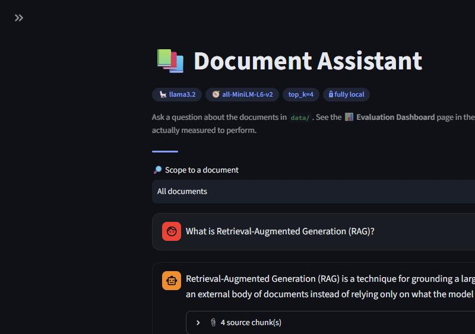
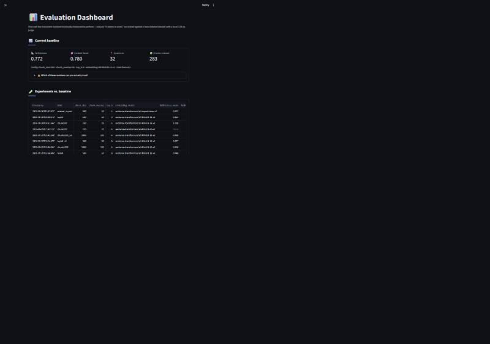

# document-assistant-with-RAG-Evaluation-System


-informational)


`RAG` · `LLM Evaluation` · `Local LLM` · `Retrieval-Augmented Generation` ·
`Ollama` · `LangChain` · `Chroma` · `Ragas` · `Streamlit` · `Python`

A RAG-based document assistant, built alongside an automated evaluation
harness (Ragas) so retrieval quality and answer correctness are measured and
regression-tested as the pipeline evolves, instead of trusted on vibes.

Runs fully locally, no API keys or cloud costs: embeddings via
`sentence-transformers` and generation via [Ollama](https://ollama.com).

<p align="center">
  
  
</p>
<p align="center"><em>Left: the chat UI answering a question, grounded in retrieved chunks. Right: the Evaluation Dashboard — the visual view into the evaluation system below.</em></p>

## Why this is an "Automated RAG Evaluation System," not just a chatbot

Most portfolio RAG projects are a chat UI over an LLM and stop there —
correctness is whatever the demo looked like at the time. This project treats
that as unacceptable and builds a second system whose only job is to keep the
first one honest:

- **A hand-labeled question set** (`eval/dataset.jsonl`, 32 questions) with a
  known-correct `ground_truth_answer` for each — including questions that are
  deliberately unanswerable, so refusals get checked too.
- **Automated scoring, not eyeballing.** `eval/run_eval_dataset.py` runs every
  question through the exact same `retrieve()`/`generate_answer()` code path
  the chat UI uses, and `eval/evaluate.py` scores the results with Ragas
  metrics (`faithfulness`, `context_recall`) using a local Ollama model as the
  judge — no manual review, no paid judge API.
- **A regression gate that actually blocks regressions.** `eval/test_regression.py`
  is a pytest suite that re-generates and re-scores the full dataset from
  scratch and fails if either metric drops more than 0.05 versus
  `eval/baseline_scores.json`. This is not a smoke test — it's been run for
  real (a ~33 minute full run against a local judge model), and it passed.
- **Isolated experimentation.** `experiments/run_experiment.py` lets you try a
  different chunk size, top-k, or embedding model against the same dataset,
  scored the same way, logged to `experiments/experiments.csv` — without ever
  touching the real vector store, so a bad experiment can't corrupt the
  baseline.

In short: retrieval and generation quality here are a number that gets
recomputed and checked, not a vibe. See below for real, unedited proof of
that in action.

## Status

Phases 1-5 substantially complete. See [PLAN.md](PLAN.md) for the full
phase-by-phase breakdown, [CONCEPTS.md](CONCEPTS.md) for the RAG/eval
concepts and hands-on findings along the way (including several real bugs
found and fixed, not just clean wins), and [FUNCTIONS.md](FUNCTIONS.md) for
what each module does.

- **Ingestion + retrieval + generation** — working end to end, both as a CLI
  (`src/ask.py`) and a two-page Streamlit UI (`app.py` — chat, document
  upload, document scoping, multi-turn conversational memory, persistent
  chat history; plus an Evaluation Dashboard page).
- **Evaluation** — a 32-question hand-labeled dataset (`eval/dataset.jsonl`),
  scored with Ragas metrics using our own local model as judge (no paid
  judge API). Current baseline: `faithfulness` 0.772, `context_recall` 0.780
  (see `eval/baseline_scores.json`) — see CONCEPTS.md for why only these two
  metrics are trustworthy with a local 3B judge model, and why the raw
  faithfulness number likely understates the true rate (the judge
  inconsistently penalizes correct "I don't know" refusals). The regression
  gate (`eval/test_regression.py`) has been run for real, not just
  structurally checked — currently passing. **Note:** 12 of the 32 questions
  are scoped to `data/my_docs/QueryCraft.pdf`, the author's own document,
  which is intentionally *not* included in this repo (see Corpus below). On a
  fresh clone those questions retrieve nothing to be scoped against and fall
  back to unscoped retrieval — expect a lower score than the committed
  baseline until you add your own document(s) and (optionally) your own
  eval questions for them.
- **Experimentation** — ten config experiments run against the baseline
  (`experiments/experiments.csv`), isolated in their own Chroma collections
  so they never touch the real data. One genuine quality win found (swapping
  to a larger embedding model), consciously not adopted in favor of speed;
  one genuine negative result (parent-child chunking, tried at two `top_k`
  values, root-caused rather than just logged) — see CONCEPTS.md for the
  full reasoning on both.
- **Corpus** — 11 synthetic RAG-concept docs plus the author's own 62-page
  college project report (`data/my_docs/QueryCraft.pdf`), 283 chunks total
  (table-of-contents/list-of-figures pages are filtered out at ingest time —
  see Architecture below).

## Architecture

### RAG pipeline

```
data/*.pdf, *.txt
     │  src/ingest.py
     │    load_documents()      — load, then drop TOC/list-of-figures pages
     │    chunk_documents()     — RecursiveCharacterTextSplitter (500 chars, 50 overlap)
     │    build_vector_store()  — embed with sentence-transformers, write to Chroma
     ▼
chroma_db/  (persistent vector store, HNSW index)
     │  src/retrieve.py
     │    retrieve(query, k, source=None)  — embed query, similarity search,
     │                                        optional single-document filter
     ▼
top-k chunks
     │  src/generate.py
     │    format_context() + grounding prompt → ChatOllama (llama3.2)
     ▼
grounded answer + cited sources
```

`src/ask.py` (CLI) and `app.py` (Streamlit chat) both call the exact same
`retrieve()` / `generate_answer()` functions — no separate logic to keep in
sync between the two front ends.

### Evaluation harness

```
eval/dataset.jsonl  (32 hand-labeled questions, some scoped to one document)
     │  eval/run_eval_dataset.py — same retrieve()/generate_answer() the apps use
     ▼
eval/results/<timestamp>.jsonl
     │  eval/evaluate.py — Ragas metrics, local Ollama judge
     ▼
eval/baseline_scores.json
     │
     ├── experiments/run_experiment.py  — try one config change in an isolated
     │                                     Chroma collection, log the delta to
     │                                     experiments/experiments.csv
     │
     └── eval/test_regression.py  — pytest gate: regenerate fresh, fail if
                                      faithfulness/context_recall drop >0.05
```

The eval harness runs the *same* code path the real apps do — it measures
what actually happens, not a simulation of it.

### Design decisions worth knowing

- **Fully local, always** — `sentence-transformers` for embeddings,
  Ollama/`llama3.2` for both generation and the eval judge. No API keys, no
  per-call cost, nothing leaves the machine. The tradeoff is a weaker judge
  than a cloud model would give (see CONCEPTS.md for the reliability
  investigation) — a deliberate choice, not an oversight.
- **Document scoping + `SCOPED_TOP_K`** — a single-document filter plus a
  higher top-k when scoped, added after a real failure: vague questions
  like "tell me about this project" retrieved the wrong document's
  boilerplate in a multi-document corpus. Verified with before/after eval
  scores, not just a plausible-sounding fix (see CONCEPTS.md).
- **Table-of-contents filtering at ingest** — pages that are mostly
  navigational (`is_toc_like()` in `src/ingest.py`) are dropped before
  chunking. A section title repeated in a TOC line can otherwise lexically
  out-rank that section's own real content for a question about the same
  topic — this actually happened and was measured, not hypothesized.
- **Chat history is storage, not memory** — `src/chat_log.py` persists past
  Q&A to a local file for the user's own reference, but it's never read
  back into the model. Multi-turn conversational memory (letting the model
  resolve "and what about NoSQL?") is a different, harder feature — the
  exact "Contextual Amnesia" gap the `QueryCraft.pdf` source document
  itself names — and is a deliberate scope cut here, not an oversight.

## Setup

1. Install [Ollama](https://ollama.com/download) and pull the chat model used
   in `src/config.py`:

   ```bash
   ollama pull llama3.2
   ```

   Ollama runs as a background service after install, so it just needs to be
   running when you use the assistant.

2. Create a virtualenv and install Python dependencies (the first run of
   `src.ingest` will also download the embedding model, ~90MB, cached by
   Hugging Face afterwards):

   ```bash
   python -m venv venv
   venv\Scripts\activate      # on Windows
   pip install -r requirements.txt
   ```

## Usage

1. Add documents to `data/` (or use the sample docs in `data/sample_docs/`
   and/or your own PDFs in `data/my_docs/`).
2. Build the vector store:

   ```bash
   python -m src.ingest
   ```

3. Ask a question — either the CLI:

   ```bash
   python -m src.ask "What is RAG?"
   ```

   or the chat UI — **make sure your venv is activated first**
   (`venv\Scripts\activate`), otherwise Streamlit runs against your system
   Python and fails with `ModuleNotFoundError: No module named 'langchain_core'`
   (or similar) since none of this project's dependencies are installed there:

   ```bash
   streamlit run app.py
   ```

   This opens a two-page app: the chat itself, and a **📊 Evaluation
   Dashboard** page (in the sidebar) showing the current baseline scores,
   every experiment run so far compared against it, and the eval dataset —
   the visual view into the "RAG Evaluation System" half of the project.

   To add your own document without touching the CLI, use the **Add a
   document** uploader in the chat page's sidebar (PDF/TXT) and click
   **Save & rebuild index** — it rebuilds the whole vector store in place.

   Use the **🔎 Scope to a document** picker above the chat to narrow
   questions to one file — important for vague questions like "tell me
   about this project" in a multi-document corpus, where searching
   everything can retrieve the wrong document's boilerplate entirely.

## Evaluation

```bash
python -m eval.run_eval_dataset     # generate answers for every eval question
python -m eval.evaluate              # score them, update eval/baseline_scores.json
python -m eval.evaluate --fast       # score with only the 2 reliable metrics (faster)
pytest eval/test_regression.py -v -s # regression gate vs. the current baseline
```

To try a config change without touching the real data:

```bash
python -m experiments.run_experiment <label> --top-k 8
python -m experiments.run_experiment <label> --chunk-size 1000 --chunk-overlap 100
python -m experiments.run_experiment <label> --embedding-model sentence-transformers/all-mpnet-base-v2
```

Each run ingests into its own isolated Chroma collection (if needed), scores
with the fast/reliable metrics, and appends a row to
`experiments/experiments.csv` comparing against the baseline.

### Example eval questions, as proof

Real rows from `eval/dataset.jsonl` and the actual generated answers/scores
from `eval/results/20260930T121458Z.jsonl` — not cherry-picked successes,
this is the same run behind the current baseline.

**1. The same question, unscoped vs. scoped — measuring the document-scoping fix**

> **q28 — "What are two limitations of QueryCraft's current system, according to the report?"** *(unscoped, searches every document)*
> Generated answer: *"I don't know. The context only discusses the objectives,
> scope, and benefits of QueryCraft, but it does not mention any limitations of
> the system."*
> Scores: `faithfulness = 0.5`, `context_recall = 0.286`
>
> Retrieval pulled chunks from the *Results*, *Scope*, and *Benefits* sections
> of the same PDF — never the actual *Limitations* section — so the model
> (correctly, given what it was shown) said it didn't know.

> **q32 — "What are the limitations of this project?"** *(scoped to `QueryCraft.pdf`, `SCOPED_TOP_K=20`)*
> Generated answer: *"...the limitations of this project are... Token Limit
> Constraints: The 'Context Window' of current LLMs is finite... Visualization
> Limits: The current result visualization is limited to tabular data..."*
> Scores: `faithfulness = 1.0`, `context_recall = 1.0`
>
> Same underlying question, same document. Scoping to one document plus a
> higher top-k surfaced the real *Limitations* section, and both metrics went
> from a partial failure to perfect. This is the exact before/after evidence
> behind the "Document scoping + `SCOPED_TOP_K`" design decision above — a
> measured fix, not a hopeful one.

**2. Correct refusal on an unanswerable question**

> **q19 — "Which cloud provider hosts the vector database used in this project?"** *(no correct answer exists in the corpus)*
> Generated answer: *"I don't know. The context only mentions Pinecone as a
> fully managed, cloud-hosted vector database, but it does not specify the
> cloud provider."*
>
> The ground truth is "not answerable" — the retrieved chunks mention Pinecone
> in the abstract but never say who hosts *this* project's database, and the
> model declined to guess rather than hallucinating a provider name. (Ragas
> reports `faithfulness = null` and `context_recall = 0.0` for this one — a
> known judge-side artifact of scoring an intentionally-empty ground-truth
> context, not a real failure; see CONCEPTS.md.)

## Project layout

```
src/
  config.py     # chunk size, top-k, scoped-top-k, model names - shared by app + eval
  ingest.py     # load -> filter TOC pages -> chunk -> embed -> store in Chroma
  retrieve.py   # embed query -> similarity search, optional single-document filter
  generate.py   # build grounding prompt from retrieved chunks -> call LLM
  ask.py        # CLI entrypoint
  chat_log.py   # persist Q&A turns to disk (never read back into the model)
app.py          # Streamlit chat UI (upload, document scoping, history)
pages/
  1_📊_Evaluation_Dashboard.py  # visual view into the eval system
data/           # source documents (gitignored except samples)
  sample_docs/  # synthetic RAG-concept docs, included in the repo
  my_docs/      # your own PDFs/txt (gitignored)
eval/
  dataset.jsonl         # 32 hand-labeled questions
  run_eval_dataset.py   # generate answers for every question
  evaluate.py           # score with Ragas, update baseline_scores.json
  test_regression.py    # pytest gate vs. the baseline
  baseline_scores.json  # current reference scores
experiments/
  run_experiment.py  # try one config change, isolated from real data
  experiments.csv    # log of every experiment run so far
```
